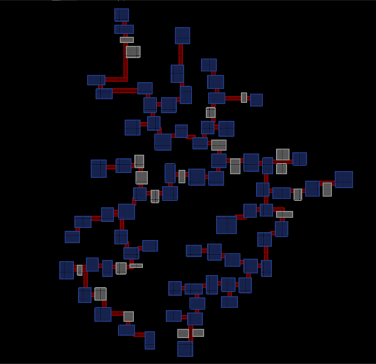
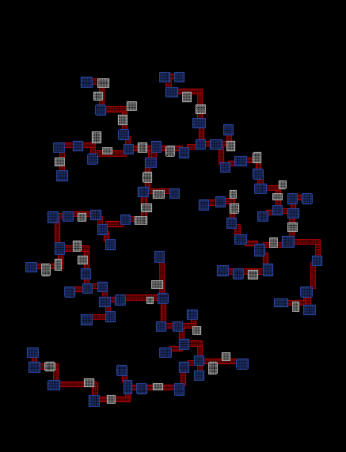
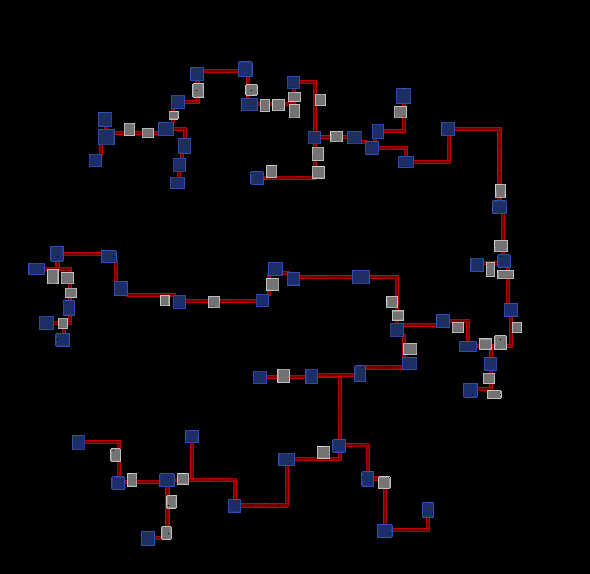
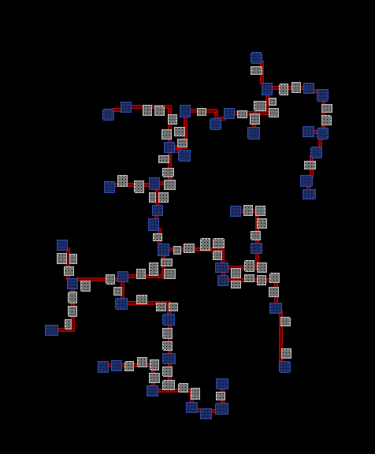

# Roguelike Dungeon Generator

## Description
This is a raw proof of concept of dungeon geometry generator for some generic roguelike or dungeon crawler game. It should be modified to suit need of gameplay specifics and transformed to fit the tile grid of a game.

## Controls
Use arrowkeys to move camera and numpad +/- to zoom in/out

## Generator Input
*  **Initial number of rooms.** It will be less in a final dungeon. 
*  **Initial room spawn radius** The rooms will be randomly generated in given radius, but can exceed it after room separation stage.
*  **Room size boundaries** Minimal and maximal sizes of room width and height. Distribution of room sizes will correspond to a normal distribution.
*  **Generation seed**

## Generator Output
* Array of main and additional rooms.
* Array of passages between rooms.
* Graph of passages between main rooms i.e. minimal spanning tree of the dungeon

## Generation pipeline
1. Generation of given number of rooms within given radius. Width and height are randomly generated and corresponded to normal distribution to prevent rooms from being too small, big or narrow.
2. Room separation. On this step I used bruteforce approach to push rooms apart from each other with minimal distance between any room not less than 1 tile. Here should be applied some 2d overlap reduction algorithm with complexity less than N^2  to reduce generation time.
3. After separation, the main rooms are getting selected by criteria of their area more than squared median of rooms sizes.
4. Delaunay triangulation is used to build a graph of main rooms.
5. For every edge of graph weight is calculated which is equal to squared distance between vertices. The Kruskal's algorithm is used to get the minimal spanning tree from obtained weighted graph.
6. As a final step, I connect rooms with straight passages if they close enough on any axis or with L-shaped passage otherwise.

## Examples of generated dungeons

